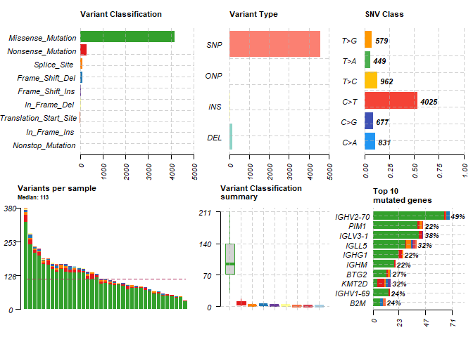
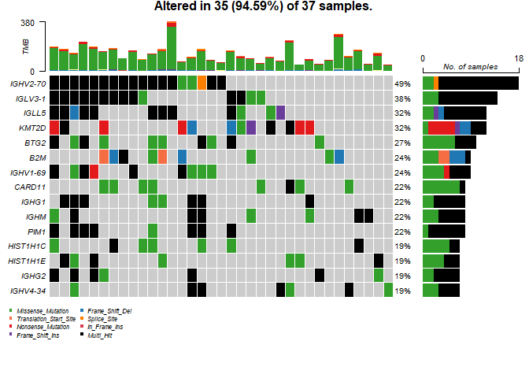
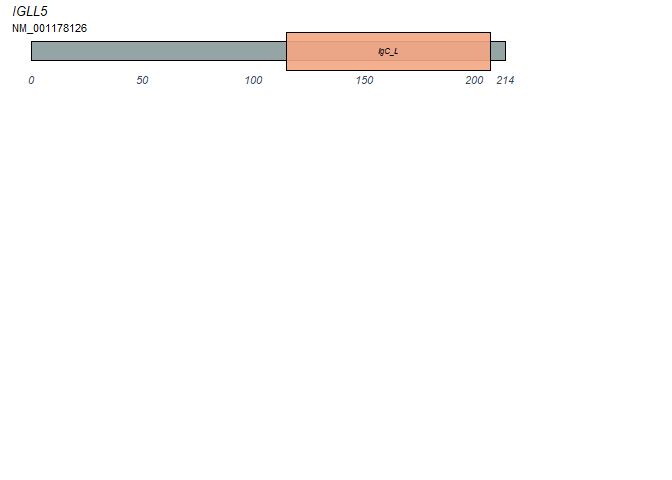
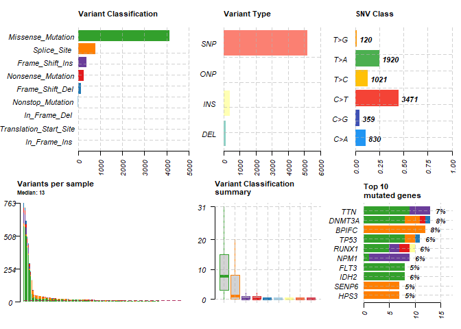
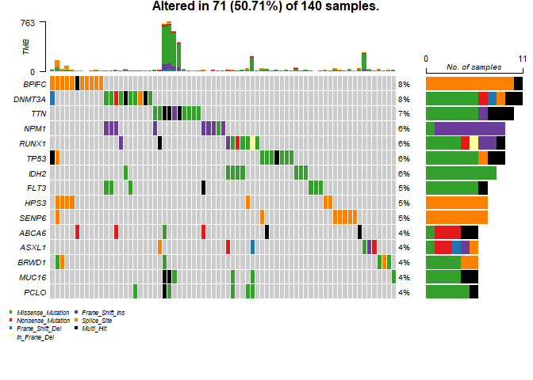
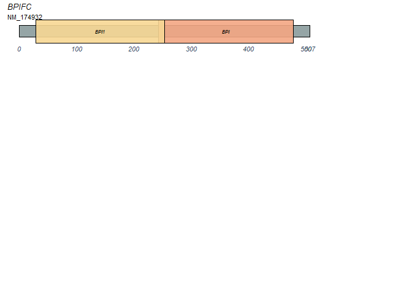

MAFTools
================
Flemming Wu
2022-10-24

``` r
#Install BiocManager if needed
if(!require("BiocManager", quietly = TRUE)){
  install.packages("BiocManager")
}

#Install maftools through BiocManager and load
if(!require("maftools", quietly = TRUE)) { BiocManager::install("maftools") }
library(maftools)

#Try to list TCGA cancer types through maftools vignette
##Does not contain all of the TCGA cancer types
list.files(system.file('extdata', package = 'mfatools'))
```

    ## character(0)

``` r
#Load in cancer types from GitHub repo
if(!require("devtools", quietly = TRUE)){ install.packages("devtools") }
```

    ## 
    ## Attaching package: 'devtools'

    ## The following object is masked from 'package:BiocManager':
    ## 
    ##     install

``` r
if(!require("TCGAmutations", quietly = TRUE)){ devtools::install_github(repo = "PoisonAlien/TCGAmutations") }


library("TCGAmutations")

tcga_available()
```

    ##     Study_Abbreviation
    ##  1:                ACC
    ##  2:               BLCA
    ##  3:               BRCA
    ##  4:               CESC
    ##  5:               CHOL
    ##  6:               COAD
    ##  7:               DLBC
    ##  8:               ESCA
    ##  9:                GBM
    ## 10:               HNSC
    ## 11:               KICH
    ## 12:               KIRC
    ## 13:               KIRP
    ## 14:               LAML
    ## 15:                LGG
    ## 16:               LIHC
    ## 17:               LUAD
    ## 18:               LUSC
    ## 19:               MESO
    ## 20:                 OV
    ## 21:               PAAD
    ## 22:               PCPG
    ## 23:               PRAD
    ## 24:               READ
    ## 25:               SARC
    ## 26:               SKCM
    ## 27:               STAD
    ## 28:               TGCT
    ## 29:               THCA
    ## 30:               THYM
    ## 31:               UCEC
    ## 32:                UCS
    ## 33:                UVM
    ## 34:            Unknown
    ##     Study_Abbreviation
    ##                                                           Study_Name  MC3
    ##  1:                                         Adrenocortical_carcinoma   92
    ##  2:                                     Bladder_Urothelial_Carcinoma  411
    ##  3:                                        Breast_invasive_carcinoma 1020
    ##  4: Cervical_squamous_cell_carcinoma_and_endocervical_adenocarcinoma  289
    ##  5:                                               Cholangiocarcinoma   36
    ##  6:                                             Colon_adenocarcinoma  404
    ##  7:                  Lymphoid_Neoplasm_Diffuse_Large_B-cell_Lymphoma   37
    ##  8:                                             Esophageal_carcinoma  184
    ##  9:                                          Glioblastoma_multiforme  390
    ## 10:                            Head_and_Neck_squamous_cell_carcinoma  507
    ## 11:                                               Kidney_Chromophobe   66
    ## 12:                                Kidney_renal_clear_cell_carcinoma  369
    ## 13:                            Kidney_renal_papillary_cell_carcinoma  281
    ## 14:                                           Acute_Myeloid_Leukemia  140
    ## 15:                                         Brain_Lower_Grade_Glioma  511
    ## 16:                                   Liver_hepatocellular_carcinoma  363
    ## 17:                                              Lung_adenocarcinoma  515
    ## 18:                                     Lung_squamous_cell_carcinoma  485
    ## 19:                                                     Mesothelioma   82
    ## 20:                                Ovarian_serous_cystadenocarcinoma  411
    ## 21:                                        Pancreatic_adenocarcinoma  177
    ## 22:                               Pheochromocytoma_and_Paraganglioma  179
    ## 23:                                          Prostate_adenocarcinoma  497
    ## 24:                                            Rectum_adenocarcinoma  149
    ## 25:                                                          Sarcoma  236
    ## 26:                                          Skin_Cutaneous_Melanoma  466
    ## 27:                                           Stomach_adenocarcinoma  439
    ## 28:                                      Testicular_Germ_Cell_Tumors  129
    ## 29:                                                Thyroid_carcinoma  492
    ## 30:                                                          Thymoma  123
    ## 31:                             Uterine_Corpus_Endometrial_Carcinoma  530
    ## 32:                                           Uterine_Carcinosarcoma   57
    ## 33:                                                   Uveal_Melanoma   80
    ## 34:                          Samples_I_couldnt_figure_out_the_source   77
    ##                                                           Study_Name  MC3
    ##                              Firehose
    ##  1:  62 [dx.doi.org/10.7908/C1610ZNC]
    ##  2: 395 [dx.doi.org/10.7908/C1MW2GGF]
    ##  3: 978 [dx.doi.org/10.7908/C1TB167Z]
    ##  4: 194 [dx.doi.org/10.7908/C1MG7NV6]
    ##  5:  35 [dx.doi.org/10.7908/C1K936V8]
    ##  6: 367 [dx.doi.org/10.7908/C1DF6QJD]
    ##  7:  48 [dx.doi.org/10.7908/C1X066DK]
    ##  8: 185 [dx.doi.org/10.7908/C1BV7FZC]
    ##  9: 283 [dx.doi.org/10.7908/C1XG9QGN]
    ## 10: 511 [dx.doi.org/10.7908/C18C9VM5]
    ## 11:  66 [dx.doi.org/10.7908/C1765DQK]
    ## 12: 476 [dx.doi.org/10.7908/C10864RM]
    ## 13: 282 [dx.doi.org/10.7908/C19C6WTF]
    ## 14: 193 [dx.doi.org/10.7908/C1D21X2X]
    ## 15: 516 [dx.doi.org/10.7908/C1MC8ZDF]
    ## 16: 373 [dx.doi.org/10.7908/C128070B]
    ## 17: 533 [dx.doi.org/10.7908/C17P8XT3]
    ## 18: 178 [dx.doi.org/10.7908/C1X34WXV]
    ## 19:                              <NA>
    ## 20: 466 [dx.doi.org/10.7908/C1736QC5]
    ## 21: 126 [dx.doi.org/10.7908/C1513XNS]
    ## 22: 179 [dx.doi.org/10.7908/C13T9GN0]
    ## 23: 498 [dx.doi.org/10.7908/C1Z037MV]
    ## 24: 122 [dx.doi.org/10.7908/C1S46RDB]
    ## 25: 247 [dx.doi.org/10.7908/C137785M]
    ## 26: 290 [dx.doi.org/10.7908/C1J67GCG]
    ## 27: 393 [dx.doi.org/10.7908/C1C828SM]
    ## 28: 147 [dx.doi.org/10.7908/C1S1820D]
    ## 29: 496 [dx.doi.org/10.7908/C16W99KN]
    ## 30: 120 [dx.doi.org/10.7908/C15T3JZ6]
    ## 31: 248 [dx.doi.org/10.7908/C1C828T2]
    ## 32:  57 [dx.doi.org/10.7908/C1PC31W8]
    ## 33:  80 [dx.doi.org/10.7908/C1S1821V]
    ## 34:                              <NA>
    ##                              Firehose

Plot data for Lymphoid Neoplasm Diffuse Large B-cell Lymphoma (DLBC)

``` r
dlbc <- tcga_load(study = "DLBC")
```

    ## Loading DLBC. Please cite: https://doi.org/10.1016/j.cels.2018.03.002 for reference

``` r
#https://doi.org/10.1016/j.cels.2018.03.002 

#Run basic summary of MAF file
dlbc
```

    ## An object of class  MAF 
    ##                         ID summary    Mean Median
    ##  1:             NCBI_Build      NA      NA     NA
    ##  2:                 Center      NA      NA     NA
    ##  3:                Samples      37      NA     NA
    ##  4:                 nGenes    3267      NA     NA
    ##  5:        Frame_Shift_Del     107   2.892      3
    ##  6:        Frame_Shift_Ins      51   1.378      1
    ##  7:           In_Frame_Del      38   1.027      1
    ##  8:           In_Frame_Ins       6   0.162      0
    ##  9:      Missense_Mutation    4171 112.730     94
    ## 10:      Nonsense_Mutation     286   7.730      6
    ## 11:       Nonstop_Mutation       5   0.135      0
    ## 12:            Splice_Site     118   3.189      2
    ## 13: Translation_Start_Site      21   0.568      0
    ## 14:                  total    4803 129.811    113

``` r
#Plot MAF summary
plotmafSummary(maf = dlbc, rmOutlier = TRUE, addStat = "median", dashboard = TRUE, titvRaw = FALSE)
```

<!-- -->

``` r
#Draw oncoplots
oncoplot(maf = dlbc, top = 15, fontSize = 0.6, legendFontSize = 0.8)
```

<!-- -->

``` r
#Create protein plots
plotProtein(gene = "IGLL5", refSeqID = 'NM_001178126')
```

<!-- -->

Plot data for Acute Myeloid Leukemia (LAML)

``` r
laml <- tcga_load(study = "LAML")
```

    ## Loading LAML. Please cite: https://doi.org/10.1016/j.cels.2018.03.002 for reference

``` r
#View summary
laml
```

    ## An object of class  MAF 
    ##                         ID summary   Mean Median
    ##  1:             NCBI_Build      NA     NA     NA
    ##  2:                 Center      NA     NA     NA
    ##  3:                Samples     140     NA     NA
    ##  4:                 nGenes    4142     NA     NA
    ##  5:        Frame_Shift_Del     131  0.936    0.0
    ##  6:        Frame_Shift_Ins     377  2.693    0.0
    ##  7:           In_Frame_Del       9  0.064    0.0
    ##  8:           In_Frame_Ins       3  0.021    0.0
    ##  9:      Missense_Mutation    4137 29.550    7.5
    ## 10:      Nonsense_Mutation     264  1.886    0.0
    ## 11:       Nonstop_Mutation      18  0.129    0.0
    ## 12:            Splice_Site     780  5.571    1.0
    ## 13: Translation_Start_Site       4  0.029    0.0
    ## 14:                  total    5723 40.879   13.0

``` r
#Plot MAF summary
plotmafSummary(maf = laml, rmOutlier = TRUE, addStat = "median", dashboard = TRUE, titvRaw = FALSE)
```

<!-- -->

``` r
#Draw oncoplots
oncoplot(maf = laml, top = 15, fontSize = 0.6, legendFontSize = 0.8)
```

<!-- -->

``` r
#Create protein plots
plotProtein(gene = "BPIFC", legendTxtSize = 0.05)
```

<!-- -->
