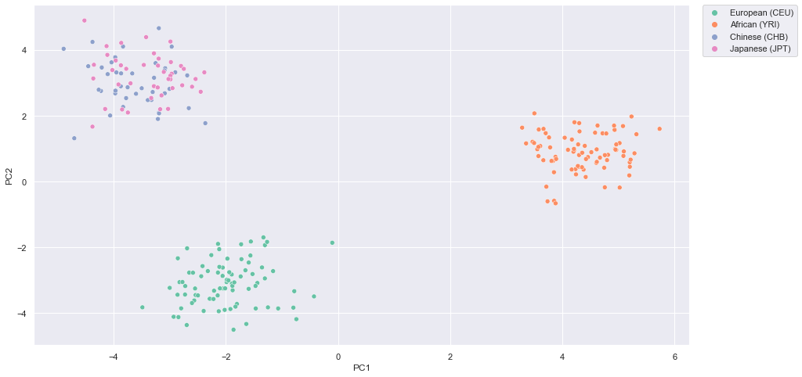

```python
! jupyter nbconvert --ClearMetadataPreprocessor.enabled=True --ClearOutput.enabled=True --to markdown README.ipynb
```


```python
import numpy as np
import pandas as pd
import matplotlib.pyplot as plt
from sklearn import decomposition
import seaborn as sns
```

Read in copy number variant (CNV) and population information data


```python
# read in cnv data
df = pd.read_csv('hm3_cnv_submission.txt', sep = '\t')

df.head()
```


<div>
<style scoped>
    .dataframe tbody tr th:only-of-type {
        vertical-align: middle;
    }

    .dataframe tbody tr th {
        vertical-align: top;
    }

    .dataframe thead th {
        text-align: right;
    }
</style>
<table border="1" class="dataframe">
  <thead>
    <tr style="text-align: right;">
      <th></th>
      <th>cnp_id</th>
      <th>chr</th>
      <th>start</th>
      <th>end</th>
      <th>NA06984</th>
      <th>NA06985</th>
      <th>NA06986</th>
      <th>NA06989</th>
      <th>NA06991</th>
      <th>NA06993</th>
      <th>...</th>
      <th>NA21733</th>
      <th>NA21738</th>
      <th>NA21739</th>
      <th>NA21740</th>
      <th>NA21741</th>
      <th>NA21768</th>
      <th>NA21776</th>
      <th>NA21784</th>
      <th>NA21825</th>
      <th>NA21826</th>
    </tr>
  </thead>
  <tbody>
    <tr>
      <th>0</th>
      <td>HM3_CNP_1</td>
      <td>1</td>
      <td>8105049</td>
      <td>8112441</td>
      <td>2.0</td>
      <td>2.0</td>
      <td>2.0</td>
      <td>2.0</td>
      <td>2.0</td>
      <td>2.0</td>
      <td>...</td>
      <td>2.0</td>
      <td>2.0</td>
      <td>2.0</td>
      <td>2.0</td>
      <td>2.0</td>
      <td>2.0</td>
      <td>2.0</td>
      <td>2.0</td>
      <td>2.0</td>
      <td>2.0</td>
    </tr>
    <tr>
      <th>1</th>
      <td>HM3_CNP_2</td>
      <td>1</td>
      <td>10292133</td>
      <td>10300570</td>
      <td>2.0</td>
      <td>2.0</td>
      <td>2.0</td>
      <td>2.0</td>
      <td>2.0</td>
      <td>2.0</td>
      <td>...</td>
      <td>2.0</td>
      <td>2.0</td>
      <td>2.0</td>
      <td>2.0</td>
      <td>2.0</td>
      <td>2.0</td>
      <td>2.0</td>
      <td>2.0</td>
      <td>2.0</td>
      <td>2.0</td>
    </tr>
    <tr>
      <th>2</th>
      <td>HM3_CNP_3</td>
      <td>1</td>
      <td>10466423</td>
      <td>10467633</td>
      <td>2.0</td>
      <td>2.0</td>
      <td>2.0</td>
      <td>2.0</td>
      <td>2.0</td>
      <td>2.0</td>
      <td>...</td>
      <td>2.0</td>
      <td>2.0</td>
      <td>2.0</td>
      <td>2.0</td>
      <td>2.0</td>
      <td>2.0</td>
      <td>2.0</td>
      <td>2.0</td>
      <td>2.0</td>
      <td>2.0</td>
    </tr>
    <tr>
      <th>3</th>
      <td>HM3_CNP_4</td>
      <td>1</td>
      <td>12764515</td>
      <td>12894420</td>
      <td>2.0</td>
      <td>2.0</td>
      <td>2.0</td>
      <td>2.0</td>
      <td>2.0</td>
      <td>2.0</td>
      <td>...</td>
      <td>2.0</td>
      <td>2.0</td>
      <td>2.0</td>
      <td>1.0</td>
      <td>2.0</td>
      <td>2.0</td>
      <td>2.0</td>
      <td>1.0</td>
      <td>2.0</td>
      <td>2.0</td>
    </tr>
    <tr>
      <th>4</th>
      <td>HM3_CNP_5</td>
      <td>1</td>
      <td>13647613</td>
      <td>13649415</td>
      <td>2.0</td>
      <td>2.0</td>
      <td>2.0</td>
      <td>2.0</td>
      <td>2.0</td>
      <td>2.0</td>
      <td>...</td>
      <td>2.0</td>
      <td>2.0</td>
      <td>2.0</td>
      <td>1.0</td>
      <td>2.0</td>
      <td>2.0</td>
      <td>2.0</td>
      <td>2.0</td>
      <td>2.0</td>
      <td>2.0</td>
    </tr>
  </tbody>
</table>
<p>5 rows × 1188 columns</p>
</div>


```python
# read in sample information into lists

YRI_file = open('YRI_samples.txt', 'r')
JPT_file = open('JPT_samples.txt', 'r')
CEU_file = open('CEU_samples.txt', 'r')
CHB_file = open('CHB_samples.txt', 'r')

YRI_data = YRI_file.read()
YRI = YRI_data.split('\n')

JPT_data = JPT_file.read()
JPT = JPT_data.split('\n')

CEU_data = CEU_file.read()
CEU = CEU_data.split('\n')

CHB_data = CHB_file.read()
CHB = CHB_data.split('\n')

YRI_file.close()
JPT_file.close()
CEU_file.close()
CHB_file.close()
```


```python
# remove empty string at end of line
YRI.remove('')
JPT.remove('')
CEU.remove('')
CHB.remove('')
```

Prepare data for PCA


```python
# set CNVs as index
df = df.set_index('cnp_id')

# remove unnecessary columns
df = df.iloc[:, 4:]

# impute NA
## will just fill the NA with 2.0, which is assuming uncalled CNVs have the normal 2 copies
df = df.fillna(2.0)

```


```python
# transpose the matrix, because the population code for a given sample will be a column, so the samples will need to be the indexes
df = df.T
```


```python
# write function to add correct population code for each sample
def assign_population(x):
    if x in CHB:
        return 'Chinese (CHB)'
    elif x in CEU:
        return 'European (CEU)'
    elif x in YRI:
        return 'African (YRI)'
    elif x in JPT:
        return 'Japanese (JPT)'
    else:
        return 'Unknown'

df['population_group'] = df.index.map(assign_population)
```


```python
df.iloc[:,-1].head() #success!
```


    NA06985    European (CEU)
    NA06986           Unknown
    NA06989           Unknown
    NA06991    European (CEU)
    NA06993    European (CEU)
    Name: population_group, dtype: object


PCA


```python
# create matrix for PCA
matrix = df.iloc[:, :-1]

# fit matrix
pca = decomposition.PCA(n_components = 2)
pca.fit(matrix)
```


    PCA(n_components=2)


```python
print(pca.singular_values_)
```

    [108.03806355  75.84612477]


```python
to_plot = pca.transform(matrix)
print(to_plot.shape)
```

    (1183, 2)


Plot PCA


```python
# make scatterplot
plt.scatter(x = to_plot[:,0], y = to_plot[:,1])
```


    <matplotlib.collections.PathCollection at 0x7f82f616e790>


    

    


Above, we can see the CNV data clustered into 3 groups based on the first two principal components!

Will now add labeling to the data to see if clustering was indeed based on CNV differences between populations.


```python
# create new data frame with population code, sample, PC1, and PC2
label_plot_df = pd.DataFrame({
    'Population_code' : df.population_group,
    'Sample' : df.index,
    'PC1' : to_plot[:,0],
    'PC2' : to_plot[:,1]
})
```


```python
label_plot_df.head() # looks correct
```


<div>
<style scoped>
    .dataframe tbody tr th:only-of-type {
        vertical-align: middle;
    }

    .dataframe tbody tr th {
        vertical-align: top;
    }

    .dataframe thead th {
        text-align: right;
    }
</style>
<table border="1" class="dataframe">
  <thead>
    <tr style="text-align: right;">
      <th></th>
      <th>Population_code</th>
      <th>Sample</th>
      <th>PC1</th>
      <th>PC2</th>
    </tr>
  </thead>
  <tbody>
    <tr>
      <th>NA06985</th>
      <td>European (CEU)</td>
      <td>NA06985</td>
      <td>-1.592362</td>
      <td>-2.465608</td>
    </tr>
    <tr>
      <th>NA06986</th>
      <td>Unknown</td>
      <td>NA06986</td>
      <td>-2.406782</td>
      <td>-2.861559</td>
    </tr>
    <tr>
      <th>NA06989</th>
      <td>Unknown</td>
      <td>NA06989</td>
      <td>-2.498762</td>
      <td>-2.810846</td>
    </tr>
    <tr>
      <th>NA06991</th>
      <td>European (CEU)</td>
      <td>NA06991</td>
      <td>-2.321385</td>
      <td>-2.724843</td>
    </tr>
    <tr>
      <th>NA06993</th>
      <td>European (CEU)</td>
      <td>NA06993</td>
      <td>-2.796366</td>
      <td>-3.857086</td>
    </tr>
  </tbody>
</table>
</div>


```python
sns.scatterplot(
    x = 'PC1',
    y = 'PC2',
    data = label_plot_df,
    hue = 'Population_code',
    palette = sns.color_palette('Set2', 5)
)
sns.set(rc = {'figure.figsize':(15,8)})

plt.legend(bbox_to_anchor = (1.02, 1), loc = 'upper left', borderaxespad = 0)
```


    <matplotlib.legend.Legend at 0x7f82f63be910>


    

    


Above, we can see that individuals of European ancestry are in the right cluster, individuals with Chinese and Japanese are in the left cluster, and individuals with African ancestry clustered in the middle. 

The observation aligns with the knowledge that genetic changes within a population occurred when humans began to migrate out of Africa and experienced environmental (and other) selective factors. It would make sense that the European and Asian clusters are further away from each other than from the African cluster.

There are many unlabeled individuals in the plot, let's remove them and look at the clusters without them.


```python
sns.scatterplot(
    x = 'PC1',
    y = 'PC2',
    data = label_plot_df.loc[label_plot_df.Population_code != 'Unknown'],
    hue = 'Population_code',
    palette = sns.color_palette('Set2', 4)
)
sns.set(rc = {'figure.figsize':(15,8)})

plt.legend(bbox_to_anchor = (1.02, 1), loc = 'upper left', borderaxespad = 0)
```


    <matplotlib.legend.Legend at 0x7f82f65afe80>


    

    


Trying tSNE


```python
from sklearn.manifold import TSNE
```


```python
X_embedded = TSNE(n_components = 2, learning_rate = 100 , init = "random").fit_transform(matrix)

X_embedded.shape
```


    (1183, 2)


```python
label_plot_df['tsne1'] = X_embedded[:, 0]
label_plot_df['tsne2'] = X_embedded[:, 1]

```


```python
sns.scatterplot(
    x = 'tsne1',
    y = 'tsne2',
    data = label_plot_df.loc[label_plot_df.Population_code != 'Unknown'],
    hue = 'Population_code',
    palette = sns.color_palette('Set2', 4)
)
sns.set(rc = {'figure.figsize':(15,8)})

plt.legend(bbox_to_anchor = (1.02, 1), loc = 'upper left', borderaxespad = 0)
```


    <matplotlib.legend.Legend at 0x7f82f63bee80>


    

    


```python

```
