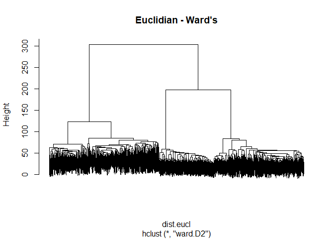
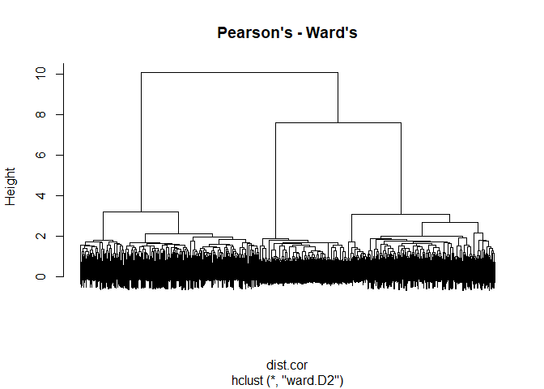
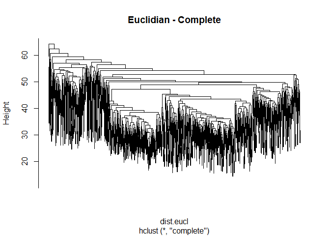
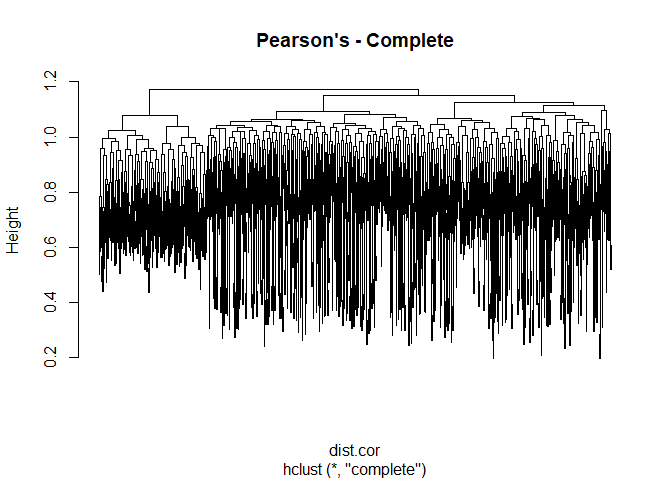
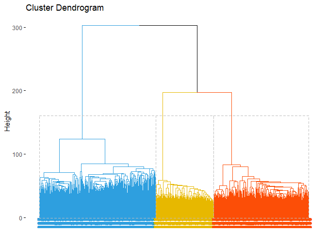
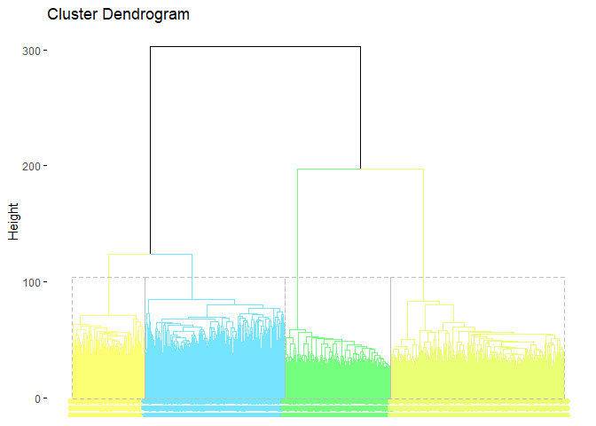

Hierarchical Clustering on Copy Number Variant Data From HapMap Project
================
Flemming Wu

``` r
CNV <- read.table("https://raw.githubusercontent.com/flemm0/TRGN514/main/Week7/hm3_cnv_submission.txt", header = TRUE, sep = "\t")

# remove chromosome number, start pos, and end pos columns
CNV <- CNV[-c(2:4)]

# set cnv ids as index and remove cnv id row to create matrix
row.names(CNV) <- CNV$cnp_id
CNV <- CNV[-c(1)]

# transpose so sample id is row and cnp id is column
CNV <- t(CNV)

# convert back to data frame
CNV <- as.data.frame(CNV)
head(CNV)[0:5] # check to see if data looks correct
```

    ##         HM3_CNP_1 HM3_CNP_2 HM3_CNP_3 HM3_CNP_4 HM3_CNP_5
    ## NA06984         2         2         2         2         2
    ## NA06985         2         2         2         2         2
    ## NA06986         2         2         2         2         2
    ## NA06989         2         2         2         2         2
    ## NA06991         2         2         2         2         2
    ## NA06993         2         2         2         2         2

``` r
# impute missing values
CNV[is.na(CNV)] <- 2
sum(is.na(CNV)) # check
```

    ## [1] 0

``` r
# normalize data by scaling to mean of 0 and standard deviation of +1/-1
CNV <- scale(CNV)
CNV[1:5,1:5]
```

    ##         HM3_CNP_1 HM3_CNP_2 HM3_CNP_3 HM3_CNP_4 HM3_CNP_5
    ## NA06984 0.1804179 0.2213611 0.1614902 0.1445484  0.260063
    ## NA06985 0.1804179 0.2213611 0.1614902 0.1445484  0.260063
    ## NA06986 0.1804179 0.2213611 0.1614902 0.1445484  0.260063
    ## NA06989 0.1804179 0.2213611 0.1614902 0.1445484  0.260063
    ## NA06991 0.1804179 0.2213611 0.1614902 0.1445484  0.260063

``` r
#### Computing Euclidean Distance and Pearson Correlation

# Base R's distance method for euclidean distance
dist.eucl <- dist(CNV, method = "euclidean")

if(!require("factoextra")) { install.packages("factoextra") }
```

    ## Loading required package: factoextra

    ## Loading required package: ggplot2

    ## Welcome! Want to learn more? See two factoextra-related books at https://goo.gl/ve3WBa

``` r
library("factoextra")

# factoextra::get_dist() for pearson correlation
dist.cor <- get_dist(CNV, method = "pearson")

# calculate optimal number of clusters for case of performing partitioning clustering
fviz_nbclust(CNV, kmeans, method = "silhouette") # 3 clusters optimal (same as PCA)
```

<!-- -->

``` r
# use linkage function to take the distance matrix and group pairs into clusters based on similarity
# ward minimizes total within-cluster variance
# complete defines dist between two clusters as max value of all pairwise distances between elements in the two clusters
hclust.ward.eucl <- hclust(d = dist.eucl, method = "ward.D2") 
hclust.ward.cor <- hclust(d = dist.cor, method = "ward.D2")
hclust.complete.eucl <- hclust(d = dist.eucl, method = "complete")
hclust.complete.cor <- hclust(d = dist.cor, method = "complete")


# plot dendrograms
plot(hclust.ward.eucl, labels = FALSE, main = "Euclidian - Ward's")
```

<!-- -->

``` r
plot(hclust.ward.cor, labels = FALSE, main = "Pearson's - Ward's")
```

<!-- -->

``` r
plot(hclust.complete.eucl, labels = FALSE, main = "Euclidian - Complete")
```

<!-- -->

``` r
plot(hclust.complete.cor, labels = FALSE, main = "Pearson's - Complete")
```

<!-- -->

``` r
# plot colored dendrograms
fviz_dend(hclust.ward.eucl, k = 3,
          labels = FALSE,
          k_colors = c("#2E9FDF", "#E7B800", "#FC4E07"),
          color_labels_by_k = TRUE,
          rect = TRUE)
```

<!-- -->

``` r
fviz_dend(hclust.ward.eucl, k = 4,
          labels = FALSE,
          k_colors = c("#FCFF74", "#74E4FF", "#74FF7F", "#EAFF74"),
          color_labels_by_k = TRUE,
          rect = TRUE)
```

<!-- -->
